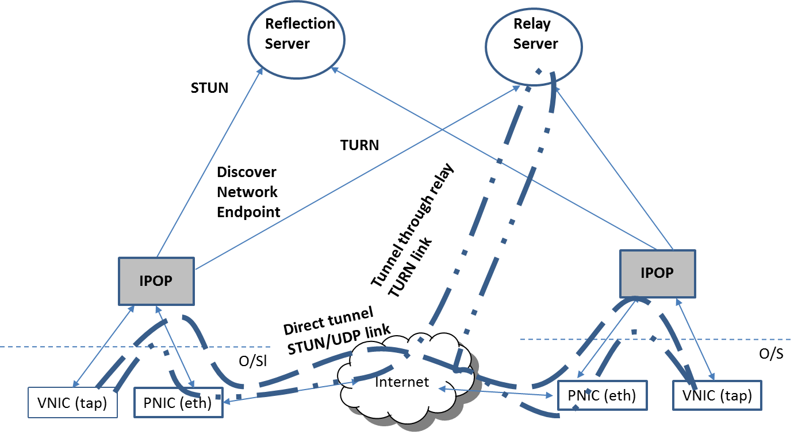

One of the key aspects of IPOP that enables it to transparently tunnel traffic between endpoint devices is its ability to traverse NATs. This is very important as IPv4 address space exhaustion, and desire for private address spaces as a line-of-defense against attacks have contributed to the proliferation of NAT devices in personal and enterprise networks. NATs complicate the process of creating end-to-end VPN tunnels, as resources behind distinct NATs are not directly addressable by each other.

IPOP leverages the libjingle library to perform NAT traversal in two major ways: IPOP leverages STUN/TURN protocols to discover their NAT endpoints and create tunnels directly with peers. STUN is employed, when possible, to discover network endpoints and punch “holes” in “cone-type” NATs and allow direct communication between endpoints through the NATs. When STUN fails (e.g. with symmetric NATs), TURN is used to select an intermediary relay node, and traffic between endpoints is routed through the TURN relay. The selection of a tunneling approach is managed autonomously by IPOP in a way that is completely transparent to applications — users are not aware whether a direct connection is a STUN- or TURN-mediated IPOP-TinCan link. IPOP allows you to specify multiple STUN/TURN services through configuration.

There are public STUN/TURN traversal services available in the Internet; we run a STUN/TURN node for demonstration purposes. You can also deploy your own STUN/TURN server(s) for your own dedicated use. Check out also the documentation on deploying your own STUN and TURN NAT traversal services.