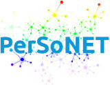



# <i class="fa fa-cubes" aria-hidden="true"></i>What is PerSoNet?

Progress in mobile and cloud computing leads to an ever-increasing number of devices with increasing diversity in capacity, capabilities and usage modalities. Furthermore, the wide adoption of Online Social Networks (OSNs) for user interaction points to a future where applications increasingly demand the ability to communicate among distributed personal devices, and across those of social peers. It is crucial for these devices to communicate with each other not only seamlessly, but also securely. However, the increased number, mobility and diversity of devices pose ever-increasing challenges. Outside of an enterprise environment, users remain typically responsible for managing their own devices which is complex and error-prone. To address these challenges, this project develops PerSoNet, a novel approach based on overlay peer-to-peer (P2P) networks allowing Internet users to seamlessly establish virtual private networks connecting their own personal devices and extending to devices of their trusted peers by leveraging OSNs as a basis for user and device discovery and for the setup of private communication channels.

PerSoNet is an unstructured P2P overlay whose topology is derived from personal device links and social networking relationships. It supports private end-to-end communication among various personal devices, leverages social relationships for the discovery and setup of private messaging channels among social peers, and applies network virtualization techniques to support unmodified software. Thus, existing and future applications can communicate privately within personal device networks and across social peers, abstracting friend connections as network links, without forfeiting the use of existing OSNs for seamless discovery and management of relationships, and exposing using well-known network abstractions and programming primitives to developers. Specifically, PerSoNet exposes a layer-2 virtual network abstraction among the set of personal devices, and a layer-3 abstraction across devices of social network users, providing a basis to support existing and future applications. The project investigates novel overlay techniques with quantitative studies, using simulation techniques and also by advancing the state-of-the-art in systems design and implementation through a software prototype and experiments with realistic applications and systems. This project has the potential to impact a large number of OSN users in applications including private data sharing, private communication among peers, and disaster- and censorship-resistant communication systems.

Trust layer (top): users establish trust relationships derived/managed from Online social networks, created via adhoc introduction. Personal network layer (bottom): devices associated with each user are connected in a OSI layer-2 like network. A subset of devices act as border switches/routers for connecting islands of personal devices. Community layer (middle): OSI layer-3 like interconnection between personal networks of users, Social gateways are logically aggregated routers responsible for routing and forwarding at this layer. Dotted lines: Alice’s AD1 is a device at Alice’s home connected via a virtual switch (AR2) to virtual switch (AR1) on a VM in a cloud service which relays message to Alice’s device AD3 via virtual routers AR2 and AR1; Carol communicates with Maya via a common friend (John) via his social gateway.

# <i class="fa fa-cubes" aria-hidden="true"></i>Publications produced as part of the project

[1]. Kyuho Jeong, Renato Figueiredo. "Self-configuring Software-defined Overlay Bypass for Seamless Inter- and Intra-cloud Virtual Networking", Proceedings of ACM International Symposium on High-Performance Parallel and Distributed Computing (ACM HPDC), 2016.

[2]. Saumitra Aditya, Renato Figueiredo. "Frugal: Building degree-constrained overlay topology from social graphs", Proceedings of IEEE International Conference on Fog and Edge Computing (IEEE ICFEC), 2017.

[3]. Kyuho Jeong, Renato Figueiredo, Kohei Ichikawa "PARES: Packet Rewriting on SDN-Enabled Edge Switches for Network Virtualization in Multi-Tenant Cloud Data Centers", Proceedings of IEEE International Conference on Cloud Computing (IEEE CLOUD), 2017.