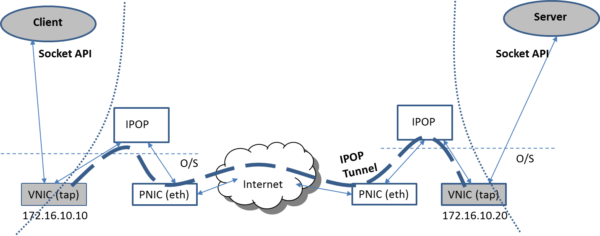

The TinCan link is the core communication abstraction used by IPOP to create tunnels. The name comes from an analogy with tin can phones – a popular children’s toy where two cans are connected by a string, creating an ad-hoc link for communication between two friends.

In IPOP, TinCan links are bi-directional communication channels that connect user devices end-to-end to other trusted user devices, where trust is derived from an online social network (OSN) service. Instead of carrying voice like a tin can phone, IPOP TinCan links carry tunneled IP packets (IPv4 or IPv6) – and since version 15.01, also Ethernet frames in IPOP’s “switch mode”. Packets are intercepted by virtual network interfaces (tap) and then tunneled by IPOP through TinCan links; at the destination, they are injected again into a virtual network interface. This allows existing applications to work unmodified when running over an IPOP virtual network, as depicted in the figure.

IPOP’s implementation of TinCan links leverages extensively the libjingle open-source code, which is widely used and can run on a variety of platforms. The IPOP-TinCan module in the source code is primarily responsible for the creation, management, and tear-down of individual TinCan links with peers. This is done under coordination of IPOP’s controller module; controller and TinCan are decoupled modules that communicate through an API layered upon local host sockets, allowing flexibility in the design and facilitating the development of new IPOP-based VPNs.

For instance, the GroupVPN controller is based on group memberships; it creates TinCan links to any online node that belongs to the group, and establishes a flat virtual IP address subnet for nodes in the group, with the purpose of creating virtual private clusters. A different controller for a different purpose – the SocialVPN – uses the same underlying primitives, but creates TinCan links to devices of the local user’s individual friends, and implements dynamic address assignment and translation to allow it to scale to large social networks.