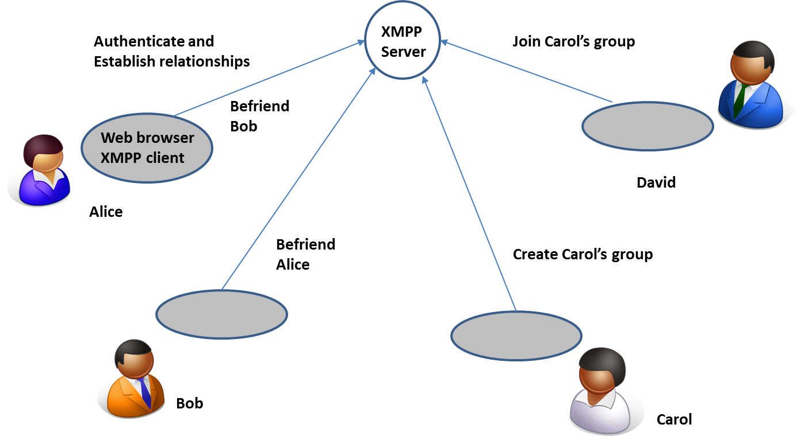
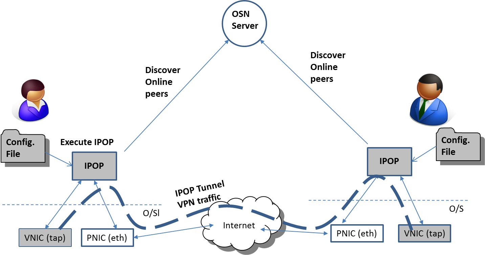

In order to create a user-defined virtual network, it is necessary for users to establish who they want to link with in their virtual network, and to configure and deploy IPOP software on their devices. The figure illustrates the process for users to establish relationships, and how IPOP controllers utilizes XMPP infrastructure to establish TinCan links. This is done through an online social network interface – independently from using IPOP.

In the typical case, a user creates and authenticates himself/herself to an account in an online social network (OSN) server; this could be a public service (e.g. Google hangout), or a private service (e.g. a private ejabberd server), through a Web interface or XMPP client (e.g. Pidgin). The user establishes relationships with other users they wish to connect to through the OSN (e.g. with friend requests). These can be peer-to-peer (e.g. in IPOP’s SocialVPN), or based on groups (e.g. in IPOP’s GroupVPN). Currently, IPOP supports the XMPP protocol to query OSN relationships, and to send messages to online peers. In the figure, Alice and Bob become friends with each other to run SocialVPN. Carol creates a group, and David joins that group.

The IPOP software typically runs on a user’s personal computer, smartphone, or on virtual machines deployed on cloud resources. Once peer relationships are established through an OSN server,  a local configuration file at each IPOP  endpoint points to the OSN server, and the user (or system administrator) simply executes the IPOP software on the resources that are to be connected to the virtual network, as depicted below. IPOP then automatically installs and configures the local VNIC, and creates end-to-end tunnels connecting to VNICs of peers determined by the OSN.

Because we use an open protocol (XMPP), it is relatively easy for you to deploy your own private XMPP service by using the open-source ejabberd software. In conjunction with deployment of your own STUN/TURN NAT traversal services, you have the option of running IPOP virtual networks that are completely under your control – in other words, the VPN links are peer-to-peer, but their configuration can be managed by centralized services.

